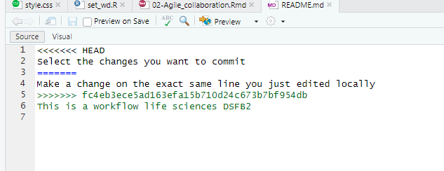
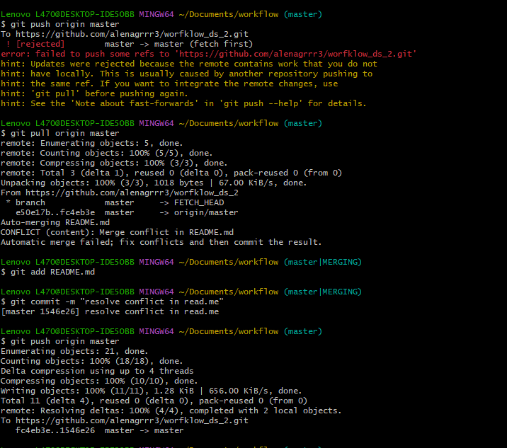
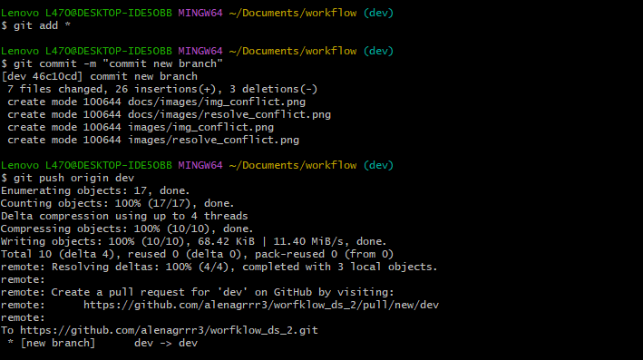
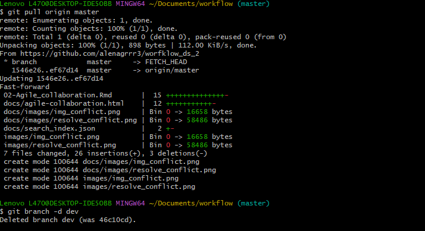
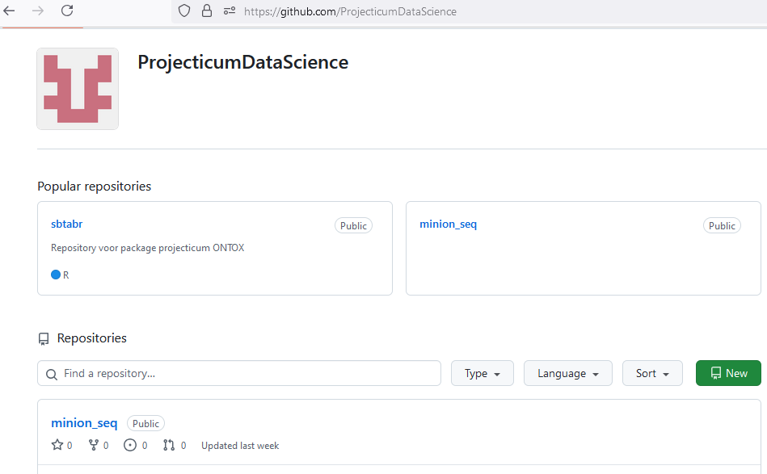
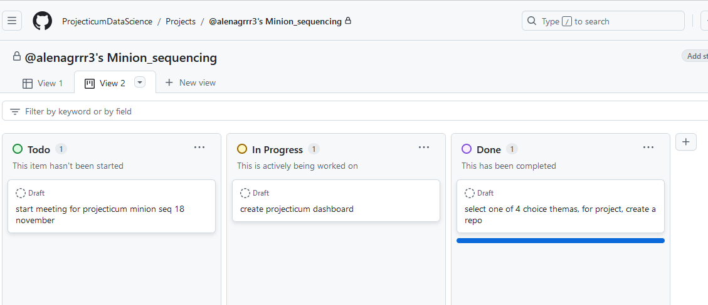

# Agile collaboration

<h3>
Lesson 2. Git conflict. </h3>

<div class="gray"> 

Lesson 2. Git conflict.
    Change 2 lines in your README.md locally (on your own computer)
    Create one commit for each change:
        Select the changes you want to commit and click commit
        Add a commit message and click Commit
    Do NOT push (yet)


</div>

 
  
  
  
<h3>
Lesson 2. Exercise 2.1 </h3>
  
 <div class="gray"> 

    Create a new branch in RStudio.
    Modify the markdown file by adding some additional text. Save the changes and commit/push the changes to GitHub. Go to GitHub and try to find the commits of the new branch.
    In RStudio, change to the main branch. What happens to your recent changes in your RMarkdown file? What happens if you change to your development branch?
    Merge your changes with the main branch by creating and resolving a pull request. In RStudio, switch to the main branch and pull your changes. Does the RMarkdown file now have the changes?
    Delete the local development branch using the command line.

</div>

 
  
  
  
  
<h3> Exercise 2  </h3>

<div class="gray">  Projecticum repository

Create one shared Git repository on GitHub for your Projecticum project.

The teachers have created a projecticum organisation on github, make sure you make your repository within this organisation.

Also make sure that the repository is shared and that your group member(s) can contribute. Subsequently, clone the GitHub repository to your computer and add your files using a development branch. Now Commit/push the changes and add the files to the main branch with a pull request.

Try working on the same files at the same time in separate branches, and merge your branches to the main branch. Solve the issues you encounter.

Try both renaming a file and merge your branches to the main branch. Solve any issues you encounter.

</div>

git clone https://github.com/ProjecticumDataScience/minion_seq.git


  
  
  
  <div class="gray">
Exercise 2.3

Study the Github Flow Documentation site mentioned above.

Discuss it with your Projecticum partner. See to it that you two really understand all the steps of the flow mentioned in the documentation.

<div>

Git documentation

https://docs.github.com/en/pull-requests/collaborating-with-pull-requests/


Plan  for vrije opdracht 

 1-2  dagen , orienteren, data zoeken
 2-3  dagen implementatie , testen, rappoartage

 140 uren workflow
 32  vrije opdracht
 
 
<div class="gray">

Exercise 2

Github documentation

    Study the github documentation on “Project Boards” here

    Setup a github project for your projecticum in your github account.

    Use the repo within the projecticum organisation, Link this repo to the github project you just created.


</div>


link for proejcticum dashboard:

https://github.com/orgs/ProjecticumDataScience/projects/36/views/2


  


<div class="gray">

To complete this exercise, you need to complete the following steps:

    Create at least 1 milestones for the first sprint of your projecticum project
    Create a number of issues that need to be resolved for these 2 milestones to be completed (link these issue to the appropriate milestone you created in the previous step)
        Remember: a good issue is so small that it can be tackled in approximately a day’s work or less!
        If you find you have little issues to solve yet for the projecticum, discuss with your partner and add more issues.
        An issue can basically be anything, but here we mean something than can be commited to a repo, such as a piece of code, a new .bib file, a dataset or documentation.
    Put these issues on the Kanban board in the ‘In progress’ column
    Each of you chooses a small issue to work on now. Choose issues that you think you could solve in max. 60 minutes for this assignment.
    Create branch for both (or all three) issues. You can choose to work on the same issue if you prefer, but we would recommend still making two branches and have github do the merging for you.
    Synchronize you local branches in RStudio, with the remote branches
    Switch to a branch of the issue you want to work on
    Start working and solving an issue (or spend max. 60 minutes working on it)
    Commit your changes, first to you local issue-branch, than push the commit to the remote (remember to use the ‘fixes #’ phrase in your commit if you fixed it)
    Create a pull request to the main branch
    Merge the pull request into main
    Observe what happened on the Kanban board. Where did the issue you just resolved land? What happened to the milestone?
    Delete the branch related to the issue you just resolved


</div>

Kanban board


<h3>  Exercise 2.12 </h3>

<div class="gray">

Exercise 2

Transform your portfolio to a local bookdown site

During this course you will collect .Rmd files with the different portfolio exercises. If everything went well, you have these files collected in your portfolio RStudio project, linked to a Github repo.

    Using the minimal example bookdown as a template, make a folder (locally) that contains a index.Rmd file that will act as the home page for your portfolio.
    Start by rendering your project using bookdown::render_book() to see if it works.
    Add any portfolio .Rmd files you already generated to the folder. You can arrange the chapters by using file names like 001_<file_name>.Rmd.
    When you have build your index.Rmd file and have collected all files in the root of your project, be sure all depending data, scripts and other files such as images etc. are also present in the project. Use the guerrilla analytics logic to setup the project structure if you lost track of it.
    Set the option new_session: yes in your _bookdown.yml or index.Rmd file. This prevent problems down the line.
    Render the book until all errors are solved. You can debug each file and error by looking at the line numbers where the rendering is causing problems.

</div>


```{r, eval=FALSE}
bookdown::render_book(".")
```


  