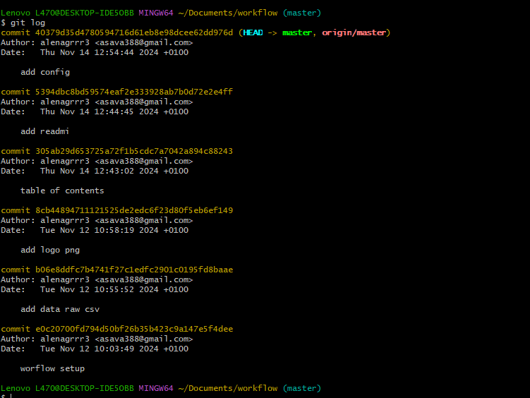

--- 
title: "worflow DSFB"
author: "alena savacehnko"
date: "`r Sys.Date()`"
site: bookdown::bookdown_site
---

# Lesson 1 Git and GitHub 

 
So, you will have at least 3 R projects (file –> new project…) going on this semester: one for all the regular exercises in the lessons. One for your portfolio. A third one for projecticum.

We suggest to call them:

    dsfb2_workflows_exercises
    dsfb2_workflows_portfolio
    dsfb2_research_project

 
    Create a new Git repository on GitHub. Make sure that the Git repository contains a gitignore file for R.
    Clone the Git repository to your computer using RStudio (hence creating an R Project on the fly).
  
    Commit the changes to the Git repository and push the changes to GitHub. Check the commit on GitHub to inspect the file changes.
    Add some extra lines to the RMarkdown file and change the title. Commit the changes and push the changes to GitHub. Check the commit on GitHub to inspect the file changes.

Link to repositories:

[dsfb2_research_project]( https://github.com/ProjecticumDataScience/minion_seq.git) 
 
[dsfb2_workflows_exercises]( https://github.com/alenagrrr3/worfklow_ds_2.git)
 
[dsfb2_workflows_portfolio]( https://github.com/alenagrrr3/portfolio_alena_savachenko.git)
 

 
Exercise 1.3, Exercise 1.4

Clone & commit

    Clone the Git repository that you created on GitHub (the same one again) to a folder on your computer using the command line.
    Change the RMarkdown file. Check the changes using git status. What do you see?
    Commit your changes and push the changes to GitHub using the command line

